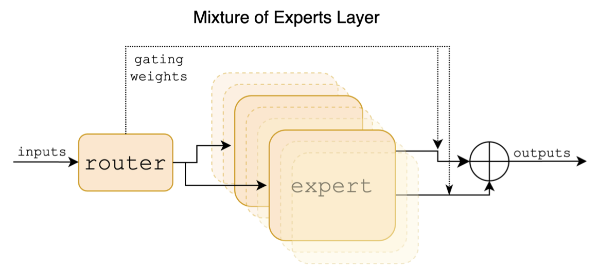
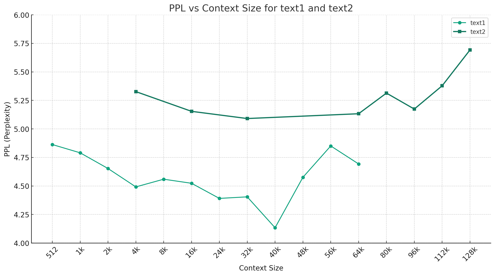

[**🇨🇳中文**](./README.md) | [**🌐English**](./README_EN.md) | [**📖文档/Docs**](https://github.com/ymcui/Chinese-Mixtral/wiki) | [**❓提问/Issues**](https://github.com/ymcui/Chinese-Mixtral/issues) | [**💬讨论/Discussions**](https://github.com/ymcui/Chinese-Mixtral/discussions) | [**⚔️竞技场/Arena**](http://llm-arena.ymcui.com/)

<p align="center">
    <br>
    
    <br>
</p>
<p align="center">
    
    
    
    <a href="https://app.codacy.com/gh/ymcui/Chinese-Mixtral/dashboard?utm_source=gh&utm_medium=referral&utm_content=&utm_campaign=Badge_grade"></a>
</p>

This project is developed based on the [Mixtral model](https://huggingface.co/mistralai/Mixtral-8x7B-v0.1) released by Mistral.ai, which utilizes a Sparse Mixture of Experts (MoE) architecture. This project involves the use of large-scale Chinese unannotated data for incremental training in Chinese, resulting in the **Chinese Mixtral** base model. Further fine-tuning with instructions led to the creation of the **Chinese Mixtral-Instruct** instruction model. This model natively supports a **32K context (tested up to 128K)** and is capable of effectively processing long texts, while also showing significant performance improvements in areas like mathematical reasoning and code generation. When using llama.cpp for quantized inference, a minimum of only 16GB of memory (or VRAM) is required.

#### Main Contents of This Project

- 🚀 Open-sourced Chinese Mixtral base model, incrementally trained in Chinese on top of [Mixtral-8x7B-v0.1](https://huggingface.co/mistralai/Mixtral-8x7B-v0.1)
- 🚀 Open-sourced Chinese Mixtral-Instruct instruction model, further fine-tuned based on the Chinese Mixtral
- 🚀 Open-sourced pre-training scripts and fine-tuning scripts for instructions, enabling users to further train or fine-tune the model as needed
- 🚀 Tutorial for quick local deployment and quantization of large models using personal computer CPU/GPU
- 🚀 Supports [🤗transformers](https://github.com/huggingface/transformers), [llama.cpp](https://github.com/ggerganov/llama.cpp), [text-generation-webui](https://github.com/oobabooga/text-generation-webui), [LangChain](https://github.com/hwchase17/langchain), [privateGPT](https://github.com/imartinez/privateGPT), [vLLM](https://github.com/vllm-project/vllm) and other Mixtral ecosystem components

----

[Chinese LLaMA-2 & Alpaca-2 Large Models](https://github.com/ymcui/Chinese-LLaMA-Alpaca-2) | [Chinese LLaMA & Alpaca Large Models](https://github.com/ymcui/Chinese-LLaMA-Alpaca) | [Multimodal Chinese LLaMA & Alpaca Large Models](https://github.com/airaria/Visual-Chinese-LLaMA-Alpaca) | [Multimodal VLE](https://github.com/iflytek/VLE) | [Chinese MiniRBT](https://github.com/iflytek/MiniRBT) | [Chinese LERT](https://github.com/ymcui/LERT) | [Chinese-English PERT](https://github.com/ymcui/PERT) | [Chinese MacBERT](https://github.com/ymcui/MacBERT) | [Chinese ELECTRA](https://github.com/ymcui/Chinese-ELECTRA) | [Chinese XLNet](https://github.com/ymcui/Chinese-XLNet) | [Chinese BERT](https://github.com/ymcui/Chinese-BERT-wwm) | [Knowledge Distillation Tool TextBrewer](https://github.com/airaria/TextBrewer) | [Model Pruning Tool TextPruner](https://github.com/airaria/TextPruner) | [Distillation and Pruning Integrated GRAIN](https://github.com/airaria/GRAIN)


## News

**[2024/01/29] 🚀 Official release of Chinese-Mixtral (Base Model), Chinese-Mixtral-Instruct (Instruction/Chat Model). For more details, see: [📚 Version 1.0 Release Notes](https://github.com/ymcui/Chinese-Mixtral/releases/tag/v1.0)**


## Content Guide
| Chapter                                                     | Description                                                  |
| ----------------------------------------------------------- | ------------------------------------------------------------ |
| [💁🏻‍♂️ Model Introduction](#Model-Introduction)               | Brief introduction to the technical features of the models related to this project |
| [⏬ Model Download](#Model-Download)                         | Download address for Chinese Mixtral large model             |
| [💻 Inference and Deployment](#Inference-and-Deployment)     | How to quantify the model and deploy it using a personal computer |
| [💯 Model Performance](#Model-Performance)                   | Introduction to the model's performance in certain tasks     |
| [📝 Training and Fine-tuning](#Training-and-Fine-tuning)     | How to train and fine-tune the Chinese Mixtral large model   |
| [❓ Frequently Asked Questions](#Frequently-Asked-Questions) | Responses to some common questions                           |


## Model Introduction

This project open-sources the Chinese Mixtral and Chinese Mixtral-Instruct models developed based on the [Mixtral model](https://huggingface.co/mistralai/Mixtral-8x7B-v0.1), with the following main features:

#### 📖 Sparse Mixture of Experts Model

Mixtral is a Sparse Mixture of Experts model. This model significantly differs from mainstream large models like LLaMA in several aspects:

- Each FFN layer contains 8 different "experts" (fully connected layers), with the best 2 activated based on gating values.
- Every token in the input sequence independently selects an expert, rather than the entire sequence corresponding to a set of experts.
- The actual parameter count is about 46.7B, with around 13B activated during inference.

Below is a structural diagram from the [Mixtral paper](https://arxiv.org/abs/2401.04088):
<p align="center">
    <br>
    
    <br>
</p>

#### 🚄 Natively Supports 32K Context (Tested up to 128K)

Unlike the [Chinese-LLaMA-Alpaca](https://github.com/ymcui/Chinese-LLaMA-Alpaca) and [Chinese-LLaMA-Alpaca-2](https://github.com/ymcui/Chinese-LLaMA-Alpaca-2) projects, the Mixtral model natively supports a 32K context (tested up to 128K). Users can use a single model to solve various tasks of different lengths.

## Model Download

### Model Selection Guide

Here is a comparison of the models in this project and the recommended use cases. **For chat interactions, please choose the Instruct version.**

| Comparison Item          |      Chinese Mixtral       |           Chinese Mixtral-Instruct           |
| :----------------------- | :------------------------: | :------------------------------------------: |
| Model Type               |       **Base Model**       | **Instruction/Chat Model (akin to ChatGPT)** |
| Model Size               | 8x7B (about 13B activated) |          8x7B (about 13B activated)          |
| Number of Experts        |      8 (2 activated)       |               8 (2 activated)                |
| Training Type            |      Causal-LM (CLM)       |           Instruction fine-tuning            |
| Training Method          |  QLoRA + Full emb/lm-head  |           QLoRA + Full emb/lm-head           |
| Based on Which Model     | Original Mixtral-8x7B-v0.1 |               Chinese Mixtral                |
| Training Corpus          | Unannotated general corpus |          Annotated instruction data          |
| Vocabulary Size          | Original vocabulary, 32000 |          Original vocabulary, 32000          |
| Supported Context Length |  32K (tested up to 128K)   |           32K (tested up to 128K)            |
| Input Template           |        Not required        | Required to apply Mixtral-Instruct template  |
| Applicable Scenarios     |     Text continuation      |                QA, chat, etc.                |


### Download Links

Three different types of models are provided below:

- **Full Version Model**: Can be used directly without any merging steps, recommended for users with sufficient network bandwidth.
- **LoRA Version Model**: Cannot be used alone, must be merged with the original [Mixtral-8x7B-v0.1](https://huggingface.co/mistralai/Mixtral-8x7B-v0.1) to convert into a full version model. Recommended for users with limited network bandwidth who already have the original Mixtral. For merging method, please refer to: [**💻 Model Merging Steps**](https://github.com/ymcui/Chinese-Mixtral/wiki/model_conversion_en)
- **GGUF Version Model**: A GGUF quantized version model compatible with tools like [llama.cpp](https://github.com/ggerganov/llama.cpp), recommended for users who only need to perform inference deployment.

| Model Name               |       Type        | Setting |                     Full Version (87 GB)                     |                    LoRA Version (2.4 GB)                     |                         GGUF Version                         |
| ------------------------ | :---------------: | :-----: | :----------------------------------------------------------: | :----------------------------------------------------------: | :----------------------------------------------------------: |
| Chinese-Mixtral          |    Base Model     |  8x7B   | [[Baidu]](https://pan.baidu.com/s/1nwJ8JkMTUrCkDEccg7C9Pw?pwd=33kb) [[🤗HF]](https://huggingface.co/hfl/chinese-mixtral) | [[Baidu]](https://pan.baidu.com/s/1XRw2-rumi-Pg0CrXqEh8ug?pwd=8gjk) [[🤗HF]](https://huggingface.co/hfl/chinese-mixtral-lora) |   [[🤗HF]](https://huggingface.co/hfl/chinese-mixtral-gguf)   |
| Chinese-Mixtral-Instruct | Instruction Model |  8x7B   | [[Baidu]](https://pan.baidu.com/s/1ogGipoWgTsojGai5cSxdoQ?pwd=dq7x) [[🤗HF]](https://huggingface.co/hfl/chinese-mixtral-instruct) | [[Baidu]](https://pan.baidu.com/s/1hX_mrYE1U1FlUEToclEOwA?pwd=h2ng) [[🤗HF]](https://huggingface.co/hfl/chinese-mixtral-instruct-lora) | [[🤗HF]](https://huggingface.co/hfl/chinese-mixtral-instruct-gguf) |

> [!NOTE]
> If you are unable to access HF, consider using some mirror sites (like hf-mirror.com), please find the method yourself.

## Inference and Deployment

The related models in this project mainly support the following quantization, inference, and deployment methods, please refer to the respective tutorials for specific content.

| Tool                                                         | Features                                                     | CPU  | GPU  | Quantization | GUI  | API  | vLLM | Tutorial                                                     |
| ------------------------------------------------------------ | ------------------------------------------------------------ | :--: | :--: | :----------: | :--: | :--: | :--: | :----------------------------------------------------------: |
| [llama.cpp](https://github.com/ggerganov/llama.cpp)          | Rich quantization options and efficient local inference      |  ✅   |  ✅   |      ✅       |  ❌   |  ✅   |  ❌   | [[link]](https://github.com/ymcui/Chinese-Mixtral/wiki/llamacpp_en) |
| [🤗Transformers](https://github.com/huggingface/transformers) | Native transformers inference interface                      |  ✅   |  ✅   |      ✅       |  ✅   |  ❌   |  ✅   | [link](https://github.com/ymcui/Chinese-Mixtral/wiki/inference_with_transformers_en)                                                      |
| [Imitation OpenAI API Call](https://platform.openai.com/docs/api-reference) | Server Demo with OpenAI API-like interface                   |  ✅   |  ✅   |      ✅       |  ❌   |  ✅   |  ✅   | [link]                                                       |
| [text-generation-webui](https://github.com/oobabooga/text-generation-webui) | Frontend Web UI deployment method                            |  ✅   |  ✅   |      ✅       |  ✅   |  ✅   |  ❌   | [link](https://github.com/ymcui/Chinese-Mixtral/wiki/text-generation-webui_en)                                                      |
| [LangChain](https://github.com/hwchase17/langchain)          | Open-source framework for large model applications suitable for secondary development |  ✅   |  ✅   |      ✅       | ❌ | ❌ | ❌ | [link] |
| [privateGPT](https://github.com/imartinez/privateGPT)                 | Local multi-document Q&A framework            |  ✅  |  ✅  |      ✅      |  ❌  |  ❌  |  ❌  | [link]                                                  |
| [LM Studio](https://lmstudio.ai)                                      | Multi-platform chat software (with interface) |  ✅  |  ✅  |      ✅      |  ✅  |  ✅  |  ❌  | [[link]](https://github.com/ymcui/Chinese-Mixtral/wiki/lmstudio_en) |


## Model Performance

To evaluate the effectiveness of the related models, this project conducted both generative effect evaluation and objective effect evaluation (NLU category), assessing large models from different perspectives. Users are recommended to test on the tasks they are interested in and choose models that are best suited for those tasks.

### Generative Effect Evaluation

- This project, inspired by [Fastchat Chatbot Arena](https://chat.lmsys.org/?arena), has launched an online model battle platform to browse and evaluate the quality of model responses. The battle platform provides evaluation metrics such as win rate and Elo rating, and one can view the win rates of model matchups. **⚔️ Model Arena: [http://llm-arena.ymcui.com](http://llm-arena.ymcui.com/)**
- The examples directory provides output samples of Chinese-Mixtral-Instruct and Chinese-Alpaca-2-13B, and compares scores using GPT-4, **with Chinese-Mixtral-Instruct averaging a score of 8.20 and Chinese-Alpaca-2-13B averaging 7.05**. **📄 Output Sample Comparison: [examples](./examples)**


### Objective Effect Evaluation

#### C-Eval

[C-Eval](https://cevalbenchmark.com) is a comprehensive Chinese baseline model evaluation suite, where the validation and test sets contain 1.3K and 12.3K multiple-choice questions, respectively, covering 52 subjects. For C-Eval inference code, please refer to this project: [📖GitHub Wiki](https://github.com/ymcui/Chinese-Mixtral/wiki/ceval_en)

| Models                                                       | Type | Valid (0-shot) | Valid (5-shot) | Test (0-shot) | Test (5-shot) |
| ------------------------------------------------------------ | :--: | :------------: | :------------: | :-----------: | :-----------: |
| **Chinese-Mixtral-Instruct**                                 | chat |      51.7      |      55.0      |     50.0      |     51.5      |
| **Chinese-Mixtral**                                          | base |      45.8      |      54.2      |     43.1      |     49.1      |
| [Mixtral-8x7B-Instruct-v0.1](https://huggingface.co/mistralai/Mixtral-8x7B-Instruct-v0.1) | chat |      51.6      |      54.0      |     48.7      |     50.7      |
| [Mixtral-8x7B-v0.1](https://huggingface.co/mistralai/Mixtral-8x7B-v0.1) | base |      47.3      |      54.6      |     46.1      |     50.3      |
| Chinese-Alpaca-2-13B                                         | chat |      44.3      |      45.9      |     42.6      |     44.0      |
| Chinese-LLaMA-2-13B                                          | base |      40.6      |      42.7      |     38.0      |     41.6      |

#### CMMLU

[CMMLU](https://github.com/haonan-li/CMMLU) is another comprehensive Chinese evaluation dataset specifically designed to assess the knowledge and reasoning ability of language models in Chinese contexts. It covers 67 topics from basic subjects to advanced professional levels, with a total of 11.5K multiple-choice questions. For CMMLU inference code, please refer to this project: [📖GitHub Wiki](https://github.com/ymcui/Chinese-Mixtral/wiki/cmmlu_en)

| Models                                                       | Type | Test (0-shot) | Test (5-shot) |
| ------------------------------------------------------------ | :--: | :-----------: | :-----------: |
| **Chinese-Mixtral-Instruct**                                 | chat |     50.0      |     53.0      |
| **Chinese-Mixtral**                                          | base |     42.5      |     51.0      |
| [Mixtral-8x7B-Instruct-v0.1](https://huggingface.co/mistralai/Mixtral-8x7B-Instruct-v0.1) | chat |     48.2      |     51.6      |
| [Mixtral-8x7B-v0.1](https://huggingface.co/mistralai/Mixtral-8x7B-v0.1) | base |     44.3      |     51.6      |
| Chinese-Alpaca-2-13B                                         | chat |     43.2      |     45.5      |
| Chinese-LLaMA-2-13B                                          | base |     38.9      |     42.5      |

#### MMLU

[MMLU](https://github.com/hendrycks/test) is an English evaluation dataset for assessing natural language understanding abilities. It is one of the main datasets used today for evaluating the capabilities of large models. The validation and test sets contain 1.5K and 14.1K multiple-choice questions, respectively, covering 57 subjects. For MMLU inference code, please refer to this project: [📖GitHub Wiki](https://github.com/ymcui/Chinese-Mixtral/wiki/mmlu_en)

| Models                                                       | Type | Valid (0-shot) | Valid (5-shot) | Test (0-shot) | Test (5-shot) |
| ------------------------------------------------------------ | :--: | :------------: | :------------: | :-----------: | :-----------: |
| **Chinese-Mixtral-Instruct**                                 | chat |      65.1      |      69.6      |     67.5      |     69.8      |
| **Chinese-Mixtral**                                          | base |      63.2      |      67.1      |     65.5      |     68.3      |
| [Mixtral-8x7B-Instruct-v0.1](https://huggingface.co/mistralai/Mixtral-8x7B-Instruct-v0.1) | chat |      68.5      |      70.4      |     68.2      |     70.2      |
| [Mixtral-8x7B-v0.1](https://huggingface.co/mistralai/Mixtral-8x7B-v0.1) | base |      64.9      |      69.0      |     67.0      |     69.5      |
| Chinese-Alpaca-2-13B                                         | chat |      49.6      |      53.2      |     50.9      |     53.5      |
| Chinese-LLaMA-2-13B                                          | base |      46.8      |      50.0      |     46.6      |     51.8      |

#### LongBench

[LongBench](https://github.com/THUDM/LongBench) is a benchmark for evaluating the long-text understanding abilities of large models. It consists of 6 categories and 20 different tasks, most of which have an average length of 5K-15K words, totaling about 4.75K test items. Below are the evaluation results of this project's model on these Chinese tasks (including coding tasks). For LongBench inference code, please refer to this project: [📖GitHub Wiki](https://github.com/ymcui/Chinese-Mixtral/wiki/longbench_en)

| Models                                                       | Single-doc QA | Multi-doc QA | Summarization | Few-shot Learning | Code Completion | Synthetic Task | Avg  |
| ------------------------------------------------------------ | :-----------: | :----------: | :-----------: | :---------------: | :-------------: | :------------: | :--: |
| **Chinese-Mixtral-Instruct**                                 |     50.3      |     34.2     |     16.4      |       42.0        |      56.1       |      89.5      | 48.1 |
| **Chinese-Mixtral**                                          |     32.0      |     23.7     |      0.4      |       42.5        |      27.4       |      14.0      | 23.3 |
| [Mixtral-8x7B-Instruct-v0.1](https://huggingface.co/mistralai/Mixtral-8x7B-Instruct-v0.1) |     56.5      |     35.7     |     15.4      |       46.0        |      63.6       |      98.0      | 52.5 |
| [Mixtral-8x7B-v0.1](https://huggingface.co/mistralai/Mixtral-8x7B-v0.1) |     35.5      |     9.5      |     16.4      |       46.5        |      57.2       |      83.5      | 41.4 |
| Chinese-Alpaca-2-13B-16K                                     |     47.9      |     26.7     |     13.0      |       22.3        |      46.6       |      21.5      | 29.7 |
| Chinese-LLaMA-2-13B-16K                                      |     36.7      |     17.7     |      3.1      |       29.8        |      13.8       |      3.0       | 17.3 |
| Chinese-Alpaca-2-7B-64K                                      |     44.7      |     28.1     |     14.4      |       39.0        |      44.6       |      5.0       | 29.3 |
| Chinese-LLaMA-2-7B-64K                                       |     27.2      |     16.4     |      6.5      |       33.0        |       7.8       |      5.0       | 16.0 |

### Quantization Effect Evaluation

Under llama.cpp, the performance of the quantized version of the Chinese-Mixtral model was tested, as shown in the table below.

|              |  F16 |   Q8_0 |   Q6_K |   Q5_K |   Q5_0 |   Q4_K |   Q4_0 |   Q3_K | IQ3_XXS |   Q2_K | IQ2_XS | IQ2_XXS |
| ------------ | ---: | -----: | -----: | -----: | -----: | -----: | -----: | -----: | ------: | -----: | -----: | ------: |
| Size (GB)    | 87.0 |   46.2 |   35.7 |   30.0 |   30.0 |   24.6 |   24.6 |   19.0 |    17.1 |   16.1 |   12.7 |    11.4 |
| BPW          | 16.0 |   8.50 |   6.57 |   5.69 |   5.52 |   4.87 |   4.53 |   3.86 |    3.14 |   2.96 |   2.34 |    2.10 |
| PPL          |    - | 4.4076 | 4.4092 | 4.4192 | 4.4224 | 4.4488 | 4.4917 | 4.5545 |  4.5990 | 5.1846 | 6.9784 |  8.5981 |
| M3 Max Speed |    - |      - |   36.0 |   36.9 |   35.7 |   31.2 |   27.8 |   37.6 |       - |   29.1 |      - |       - |
| A100 Speed   |    - |      - |   29.9 |   22.6 |   20.5 |   21.7 |   17.1 |   21.7 |    20.6 |   20.3 |   23.7 |    22.5 |

> [!NOTE]
>
> - Model Size: in GB
> - BPW (Bits-Per-Weight): Bits per unit parameter, e.g., Q6_K has an actual average precision of 6.57 bits
> - PPL (Perplexity): Measured with a 4K context, lower values are better
> - Generation Speed: Provided for Apple M3 Max (Metal) and NVIDIA A100 (40G) generation speed (ms/token), lower values are better

Taking Chinese-Mixtral-Q4_0 as an example, the following figure shows the trend of PPL changes under different context lengths, with two different sets of pure text data selected. The experimental results indicate that **the context length supported by the Mixtral model exceeds the nominal 32K, and it still performs well in contexts of 64K+ (tested up to 128K).**

<p align="center">
    <br>
    
    <br>
</p>

## Training and Fine-Tuning

### Pre-training

- Based on the original Mixtral model, incremental training was carried out using large-scale unlabeled data to obtain the Chinese-Mixtral base model.
- Training data used the same data as in the [Chinese-LLaMA-Alpaca](https://github.com/ymcui/Chinese-LLaMA-Alpaca) project for the base model, totaling about 20G of pure text files.
- Training code and tutorial: [📖 Pre-training Scripts Wiki](https://github.com/ymcui/Chinese-Mixtral/wiki/pt_scripts_en)

### Instruction Fine-Tuning

- Based on Chinese-Mixtral, further fine-tuning was done using annotated instruction data to obtain the Chinese-Mixtral-Instruct instruction model.
- Training data used instruction data from the [Chinese-LLaMA-Alpaca-2](https://github.com/ymcui/Chinese-LLaMA-Alpaca-2) project, totaling about 5 million instruction data.
- Training code and tutorial: [📖 Instruction Fine-Tuning Scripts Wiki](https://github.com/ymcui/Chinese-Mixtral/wiki/sft_scripts_en)

[Instruction Template](https://huggingface.co/mistralai/Mixtral-8x7B-Instruct-v0.1#instruction-format):

```
<s> [INST] Instruction [/INST] Model answer</s> [INST] Follow-up instruction [/INST]
```

Note: `<s>` and `</s>` are special tokens indicating the start and end of a sequence, while `[INST]` and `[/INST]` are ordinary strings.

## Frequently Asked Questions

Please make sure to check the FAQ for existing solutions before raising an Issue. For specific questions and answers, refer to the project's [📖GitHub Wiki](https://github.com/ymcui/Chinese-Mixtral/wiki/faq_en)

```
Question 1: Will there be training with more data in the future? Will there be RLHF/DPO alignment?
Question 2: Why wasn't there an expansion of the Chinese vocabulary in this model?
Question 3: Is the downstream ecosystem of Mixtral supported?
```

## Citation

TBA


## Disclaimer

This project is based on the Mixtral model released by Mistral.ai and developed accordingly. Please strictly adhere to Mixtral's open-source license agreement during use. If third-party codes are involved, please comply with the relevant open-source licenses. The accuracy of the content generated by the model may be affected by computational methods, random factors, and loss of quantization precision. Therefore, this project does not guarantee the accuracy of the model's output and will not bear responsibility for any losses arising from the use of related resources and output results. If the models from this project are used for commercial purposes, developers should comply with local laws and regulations to ensure the compliance of the model output content. This project does not bear responsibility for any products or services derived from its use.


## Feedback

If you have any questions, please submit them in the GitHub Issues. Please raise issues politely to build a harmonious discussion community.

- Before submitting an issue, please check if the FAQ can solve your problem, and it is also advisable to review past issues.
- When submitting an issue, please use the Issue template set by this project to help quickly identify specific problems.
- Duplicate or unrelated issues will be handled by [stable-bot](https://github.com/marketplace/stale), thank you for your understanding.
